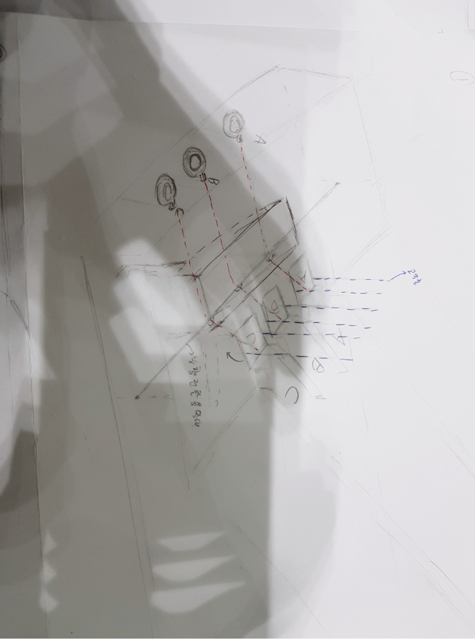

### 재료 구매 및 용도 정리(11.22 )
1. 몸체 제작 및 리듬 게임요소
- 하드보드지와 우드락, 구슬

2. 몸체의 배경 변화
- PVC필름 및 모터 사용
- 그림을 그린 후 모터를 이용하여 배경을 계속해서 변화시키기를 구상 중

3. 구슬 낙하를 위한 기구 제작
- 물레방아 모형으로 제작 구상 중
- 칸에 구슬을 하나씩 넣고, 일정 박자에 맞춰 낙하

4. 버튼 제작
- 용수철, 실, 고무줄, 고리
###### 천장에 고무줄을 연결하고(파란줄) A,B,C의 뚜껑에 고무줄을 연결한다.
###### A,B,C 고리(버튼)에는 실을(빨간줄) 빳빳하게 연결하고 이를 나무막대에 고정한다.
###### 나무막대는 뚜껑을 향해 용수철을 연결하여 고리를 당겼을 때, 실의 장력으로 용수철을 당긴다.
###### 이로 인해 뚜껑이 열리며 공은 상자에 들어갈 수 있게 된다.
###### 이후 고리(버튼)을 놓으면, 용수철의 탄성력에 의해 뚜껑은 다시 닫히게 된다.
- 버튼 구상도

5. 방해요소
- 나무막대를 작게 잘라 이용

참고 - 스코어링 방법 : [https://github.com/moomin-04/YOLO-2018920056/issues/26]

참고 - 1차 구상도 :
[https://github.com/moomin-04/YOLO-2018920056/issues/23]
