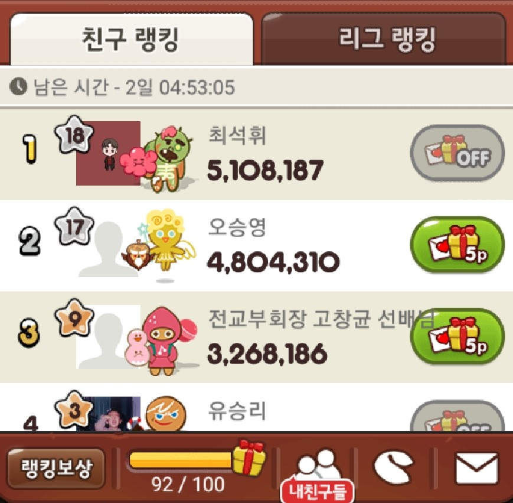
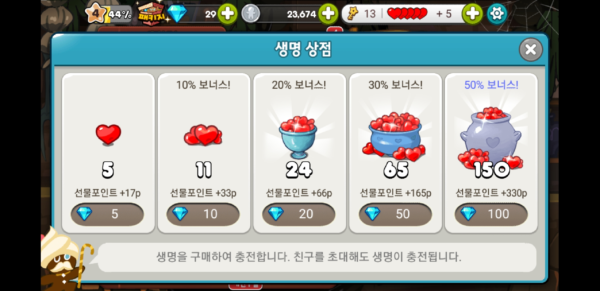
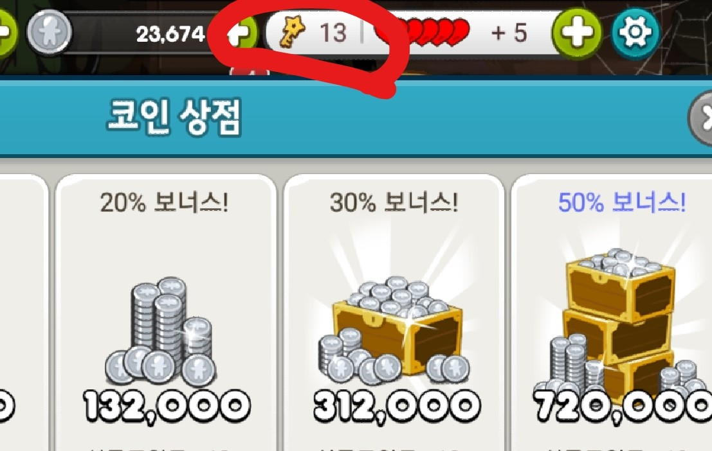

# 생명
##### 생명은?
* 한판을 플레이 할 때마다 1개씩 소모됨.
* 소모로인해 생명이 4개이하가 되면 8분마다 1개씩 충전됨.(소지개수 제한X)
* 친구에게 선물 포인트 5p와 생명을 1개를 함께 주고 받을 수 있음.

----
### 생명 구매
생명 | 크리스탈 | 선물 포인트 | 크리스탈당 생명| 실제가격(원)
-------------|----------|-----------|----------|----------
5| 5| 17p | 1|  438.5
11| 10| 33p| 1.1|964.7
24| 20| 66p| 1.2|2104.8
65| 50| 165p| 1.3|5700.5
150| 100| 330p| 1.5|13155

>**실제가격**: 크리스탈의 개당 가격의 평균값을 구하기위해 6가지의 가격을 더한 후 6으로 나눠 구한것으로 크리스탈 한 개당 평균값은 87.70833...이다. (개당 87.7원으로 계산)
---
### 황금열쇠
##### 황금열쇠는?
* 유령해적의 코인섬과 얼음파도의 탑 플레이시 생명대신 소모됨.  
* 소모로인해 2개이하가 되면 20분마다 1개씩 충전됨. (소지개수 제한X)

### 열쇠 획득 방법
* 메달 교환소
  * 메달 60개로 열괴 5개 구매 가능.

* 생명
  * 생명 20개당 열쇠 1개.

* 크리스탈

  황금열쇠 | 크리스탈 | 선물 포인트 | 크리스탈당 열쇠| 실제가격(원)
  -------------|----------|-----------|----------|----------
  5| 10 | 33p| 0.5| 877
  18| 30| 99p| 0.6| 2631
  33| 50| 165p| 0.66| 4385
  75| 99| 330p| 0.7575| 8682.3

>크리스탈로의 구매에는 제한이 없으나 생명으로 구매는 하루에 5개까지만 가능
