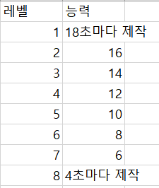

# 생크림 모카 커피
### 이미지

### 소개
- 생크림이 듬뿍 얹어진 모카커피
### 등급
- B등급
### 입수 경로
- B단계부터는 펫 부화하기, 고급 펫 부화하기, 선물상자 펫 부화하기에서 얻을 수 있다.
### 능력
- 알파벳젤리 제작(알파벳 젤리를 다 모으면 보너스 타임을 얻는다)

### 콤비 쿠키와 조합 보너스
커피맛 쿠키와 콤비이며 조합 보너스는 펫 쿨타임 30%감소이다. 따라서 레벨 8단계에서는 약 3초마다 젤리를 제작한다.
