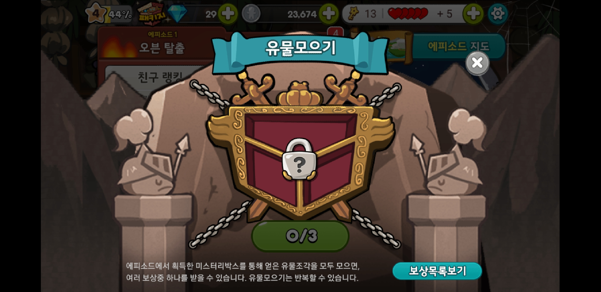

# 유물 모으기
#### 유물 모으기란?
* 유물조각은 게임 중에 얻는 미스터리 박스를 열어서 얻거나 메달교환소에서 메달과 교환하여 얻을 수 있음.
* 이 조각을 모두 모으면 L급 쿠키나 아이템 등의 보상을 줌.

---
#### 에피소드1 오븐 탈출
* **일반 보상**
  * 크리스탈 5, 10개
  * 최고급 보물 뽑기권 1개
  * 20,000 코인/ 30,000 코인
  * 마법가루 500/ 800/ 2,500
  * 황금열쇠 3개/ 5개/ 10개
  * 생명 30개
* **특별 보상**
  * 초코 왕방울

#### 에피소드2 원시림
* **일반 보상**
  * 크리스탈 10, 15개
  * 최고급 보물 뽑기권 1개
  * 25,000 코인/ 35,000 코인
  * 마법가루 600/ 900/ 2,500
  * 황금열쇠 5개/ 7개/ 10개
  * 생명 50개
* **특별 보상**
  * 정글 쿠키전사

#### 에피소드3 용의 협곡
* **일반 보상**
  * 크리스탈 10, 15개
  * 최고급 보물 뽑기권 1개
  * 25,000 코인/ 35,000 코인
  * 마법가루 800/ 1,000/ 2,500
  * 황금열쇠 5개/ 7개/ 10개
  * 생명 80개
* **특별 보상**
  * 불꽃정령 쿠키

#### 에피소드4 마법사들의 도시
* **일반 보상**
  * 크리스탈 10, 15개
  * 최고급 보물 뽑기권 1개
  * 25,000 코인/ 35,000 코인
  * 마법가루 800/ 1,000/ 2,500
  * 황금열쇠 5개/ 7개/ 10개
  * 생명 80개
* **특별 보상**
  * 달빛술사 쿠키

#### 에피소드5 디저트 파라다이스
* **일반 보상**
  * 크리스탈 10, 15개
  * 최고급 보물 뽑기권 1개
  * 25,000 코인/ 35,000 코인
  * 마법가루 800/ 1,000/ 2,500
  * 황금열쇠 5개/ 7개/ 10개
  * 생명 80개
* **특별 보상**
  * 바람궁수 쿠키

#### 스페셜 에피소드1 유령해적의 코인섬
* **일반 보상**
  * 크리스탈 10, 15개
  * 최고급 보물 뽑기권 1개
  * 25,000 코인/ 35,000 코인
  * 마법가루 800/ 1,000/ 2,500
  * 황금열쇠 5개/ 7개/ 10개
  * 생명 80개
* **특별 보상**
  * 코인섬을 가리키는 나침반

#### 스페셜 에피소드2 얼믕파도의 탑
* **일반 보상**
  * 크리스탈 10, 15개
  * 최고급 보물 뽑기권 1개
  * 25,000 코인/ 35,000 코인
  * 마법가루 800/ 1,000/ 2,500
  * 황금열쇠 5개/ 7개/ 10개
  * 생명 80개
* **특별 보상**
  * 달을 향한 바다요정의 마음
