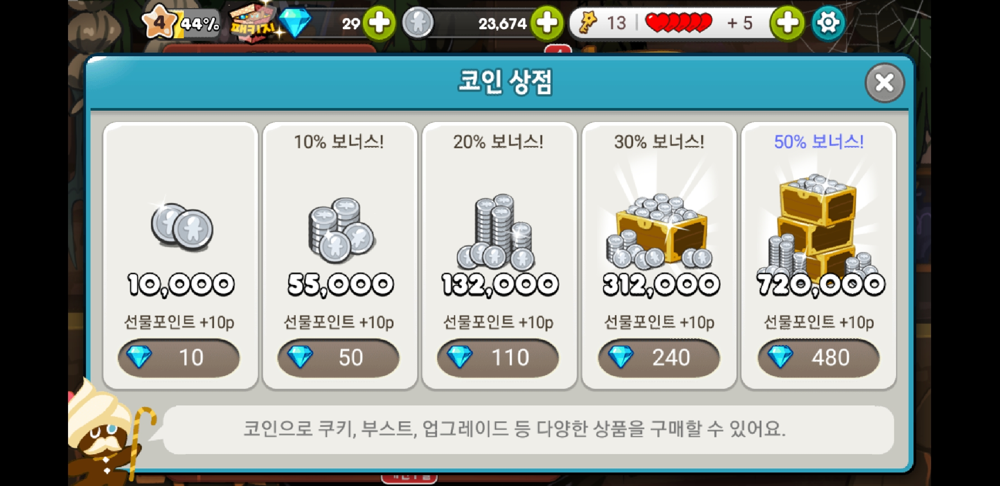

# 코인
### 코인 구매
코인 | 크리스탈 | 선물 포인트 | 크리스탈당 코인| 실제가격(원)
-------------|----------|-----------|----------|----------
10,000| 10| 10p| 1,000| 877
55,000| 50| 10p| 1,100| 4,385
132,000 | 110| 10p| 1,200| 9,647
321,000 | 240| 10p| 1,337.5| 21,048
720,000| 480| 10p| 1,500| 42,096

>**실제가격**: 크리스탈의 개당 가격의 평균값을 구하기위해 6가지의 가격을 더한 후 6으로 나눠 구한것으로 크리스탈 한 개당 평균값은 87.70833...이다. (개당 87.7원으로 계산)

