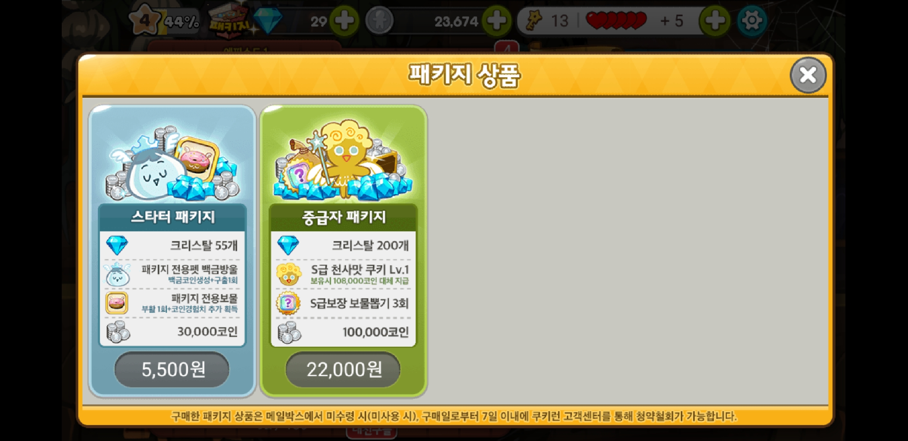

# 패키지
#### 패키지란?
* 계정당 1회만 구매가능한 유료 아이템 박스로 비교적 저렴한 가격에 여러 유용한 아이템을 얻을 수 있음.

---
### 스타터 패키지
* 가격
  * 5,500원
* 구성 아이템
  * 크리스탈 55개
  * 패키지 전용펫 백금방울
    * 백금 코인 생성 + 구출 1회
  * 패키지 전용보물
    * 부활 1회 + 코인 경험치 추가 획득
  * 30,000 코인
* 실제 예상 가격
  * 크리스탈 55개(5,500원) + 코인 30,000(2,631원) + 아이템(추정 힘듬) = 약 8,131원
  * (실제 예상 가격) - (가격) = 2,631원

### 중급자 패키
* 가격
  * 22,000원
* 구성 아이템
  * 크리스탈 200개
  * S급 천사맛 쿠기 Lv.1
    * 보유시 108,000코인으로 대체지급
    * 실제 구매시 크리스탈 99개
  * S급 보장 보물 뽑기 3회
    * S~A등급 보물상자는 실제 구매시 1회에 크리스탈 25개
  * 100,000 코인
* 실제 예상 가격
  * 크리스탈 200개(약 19,000) + 천사맛 쿠기(약 9,900원) + 보물 뽑기3회 (약 7,500원) + 100,000코인(약 7,893원) = 약 4,4293원
  * (실제 예상 가격) - (가격) = 약 22,293원
